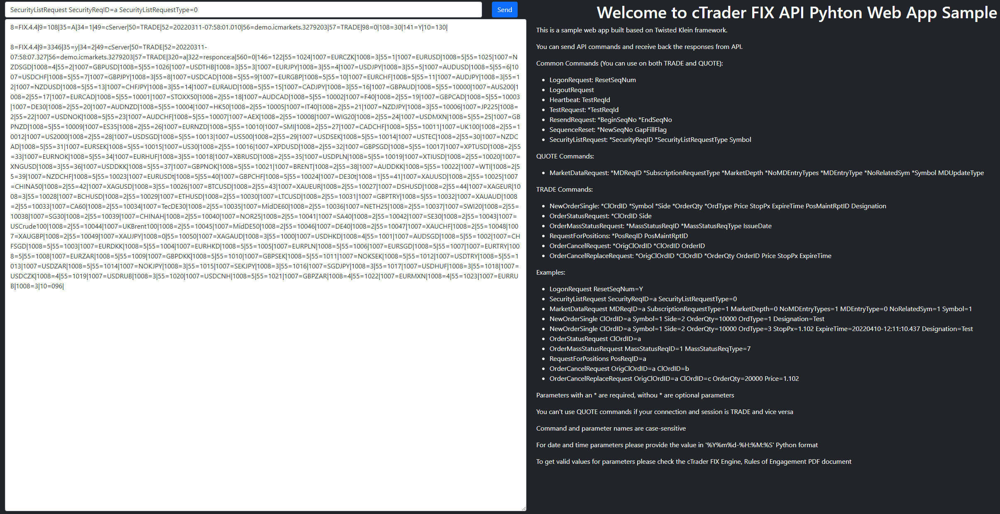

# Klein Web App Sample

This is the web sample for Spotware OpenApiPy Python package.

It's based on Twisted [Klein](https://github.com/twisted/klein) web framework.

You can send and receive API commands by using this sample, it's very similar to Console sample.

Before running the sample you have to create a config file and fill it with your trading account FIX API credentials.

Then replace the config file name on sample main file to your config file name.

Config file sample:

```json
{
  "Host": "",
  "Port": 0,
  "SSL": false,
  "Username": "",
  "Password": "",
  "BeginString": "FIX.4.4",
  "SenderCompID": "",
  "SenderSubID": "QUOTE",
  "TargetCompID": "cServer",
  "TargetSubID": "QUOTE",
  "HeartBeat": "30"
}
```

After that install Klein with pip:
```
pip install klein
```

Then run the "main.py" file.

Open the "localhost:8080" on your web browser.


